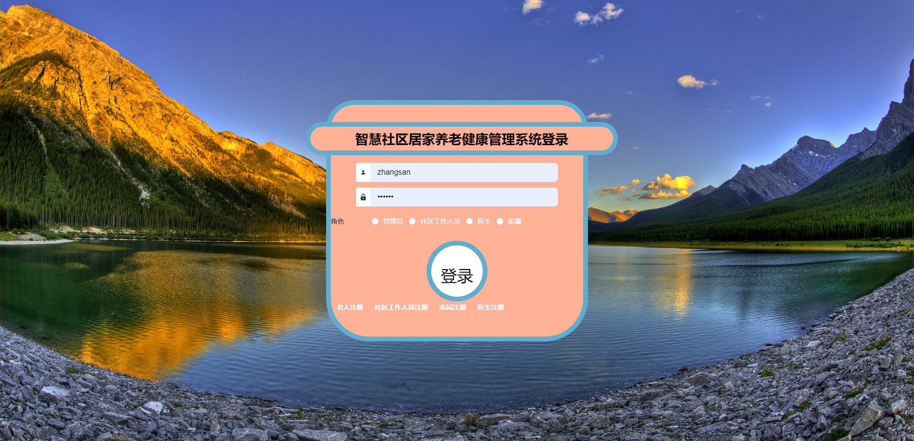
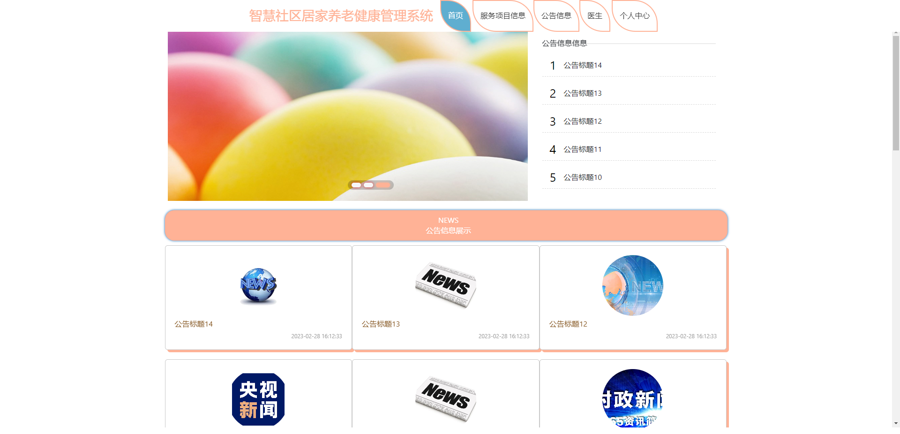
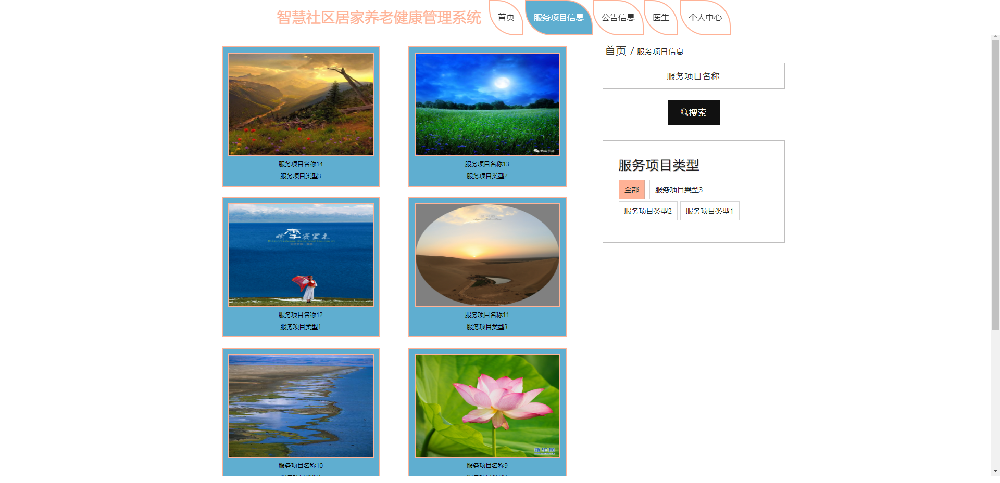
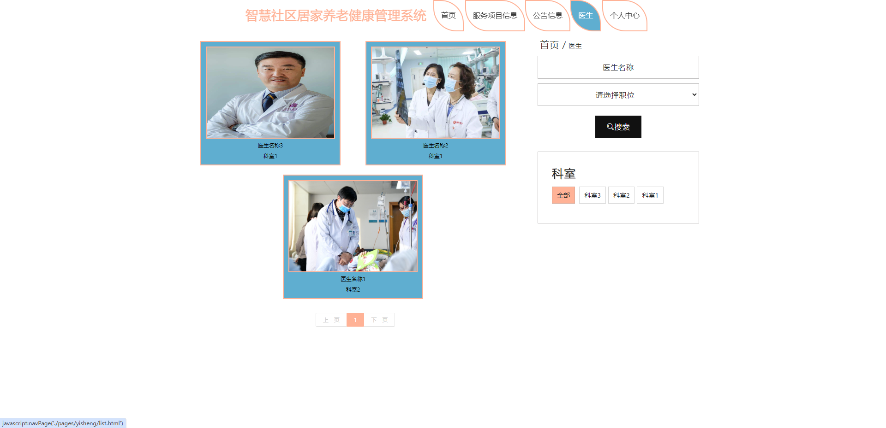
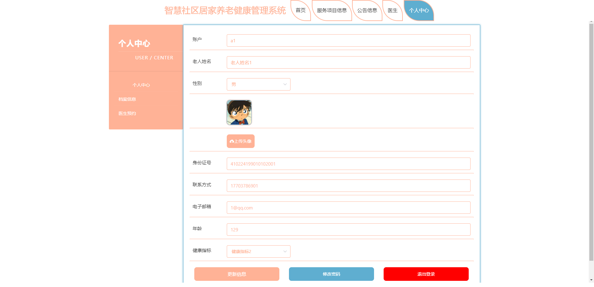
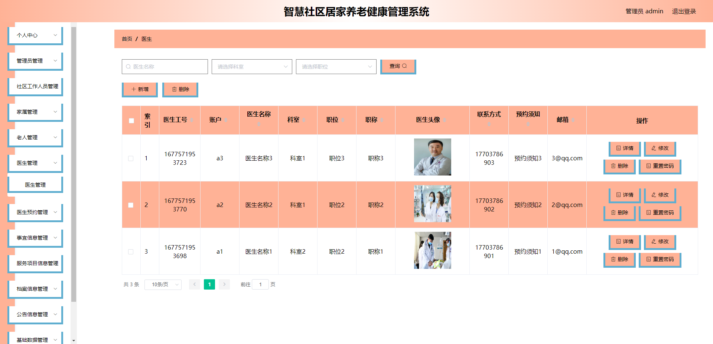
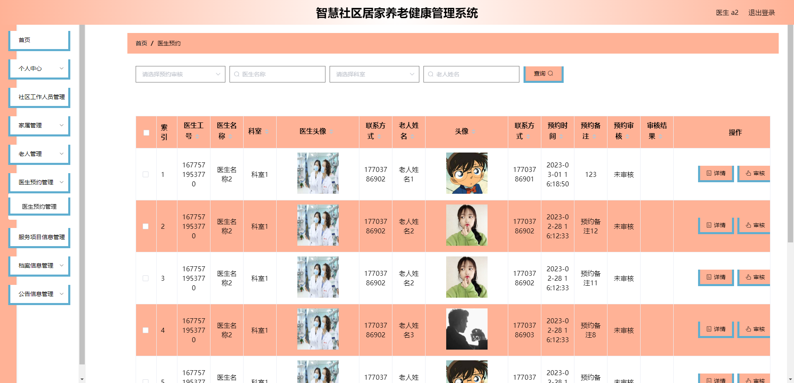
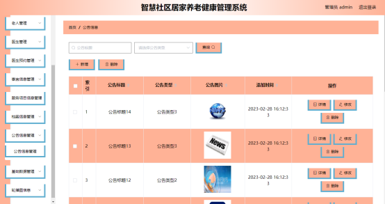
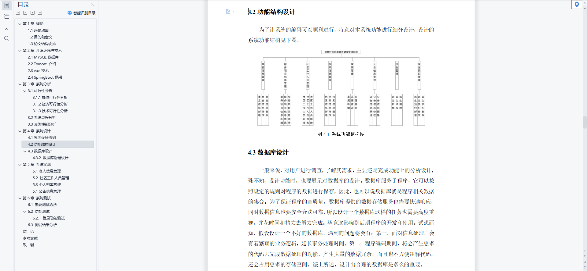
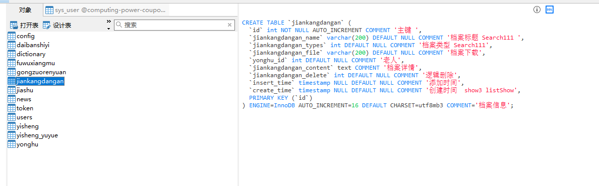

# 1 项目介绍
基于SSM+Vue的社区养老管理系统：后端 SpringBoot、Mybatis-Plus，前端Vue+ElementUI，具体功能如下：
## 管理员
- 基本功能：查看和修改个人信息、用户(管理员、工作人员、老人、医生、家属)管理
- 医生预约管理
- 事项事宜管理
- 服务项目信息管理
- 档案信息管理
- 公告信息管理
- 基础数据管理(事宜类型、服务项目类型、健康指标、档案类型、公告类型、身份管理、可是管理、职位管理)
- 轮播图管理
## 工作人员
- 基本功能：查看和修改个人信息、用户(老人、医生、家属)管理
- 医生预约管理
- 事项事宜管理
- 服务项目信息管理
- 档案信息管理
- 公告信息管理
## 医生
- 基本功能：查看和修改个人信息、用户(老人、工作人员、家属)管理
- 医生预约管理
- 服务项目信息管理
- 档案信息管理
- 公告信息管理
## 家属
- 基本功能：查看和修改个人信息、用户(老人、医生、家属)管理
- 医生预约管理
- 服务项目信息管理
- 档案信息管理
- 公告信息管理
## 老人(前台登录)
- 基本功能：查看和修改个人信息
- 查看公告
- 查看服务项目
- 查看医生，预约服务
# 2 系统运行截图
## 2.1 用户登录

## 2.2 前台首页

## 2.3 服务项目信息

## 2.4 医生信息

## 2.5 个人中心

## 2.6 医生管理

## 2.7 医生预约管理

## 2.8 公告管理

## 2.9 论文

# 3 数据库设计

# 4 源码数据库获取(收费)

